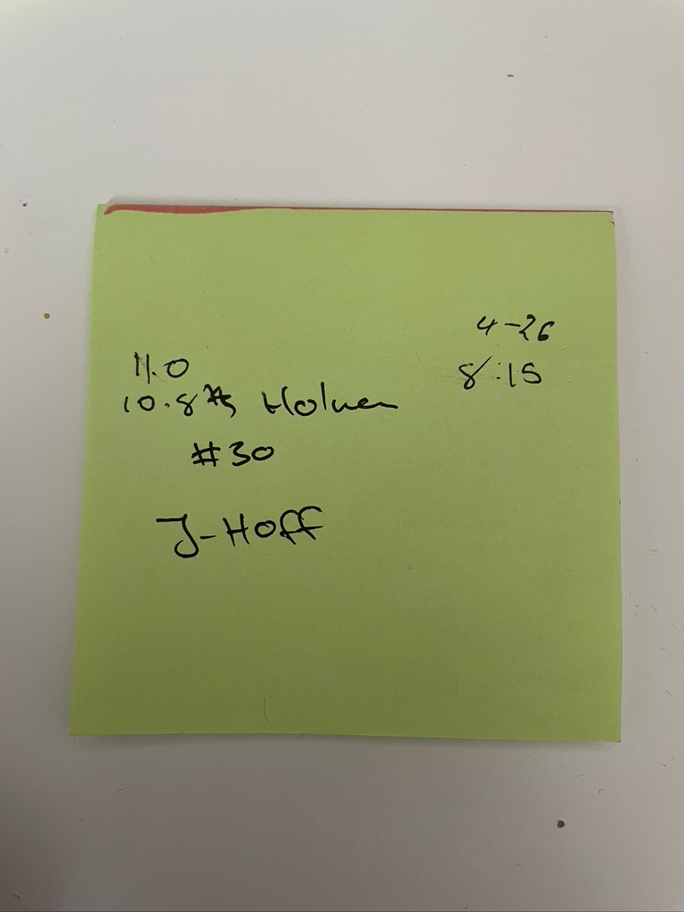
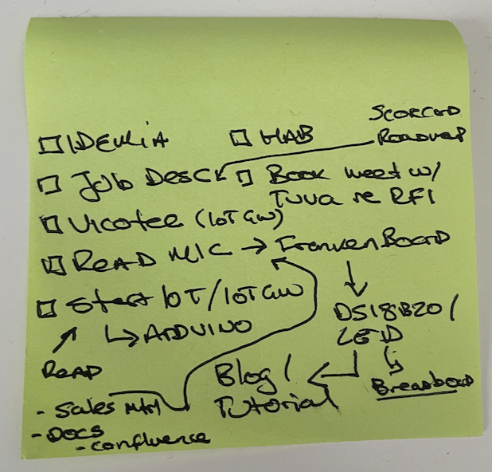
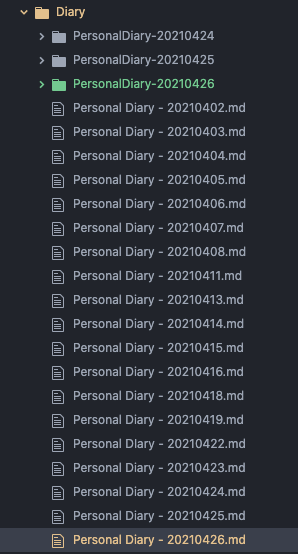

- Tim contacted me on LinkedIn regarding a job at watt - watchers; need to sync up (chatting on Messenger; Grant (his boss) pinged me on LinkedIn)
  - never want to say no, but at the same time, there are a few warning bells
    - startup & job security
      - cashflow neutral...
      - future?
    - tims current opinions and stress levels
      - bad week... budget was problematic ... don't let it flavor
    - remote to aus? industry knowledge, time zones...
    - .net? (mondo) - python & c on 4G engine (cinterion & bg95)
    - reports to Grant
  - chatted hacking and the frankenboard
  - showed off my stack of postits from the weekend and why a better note systems is required; stop writing notes and start doing more

2021-04-26T15:14:25
- importing Postits
  - pre-pull
  
  - post-pull
  
  - diff? (Coffee...)
