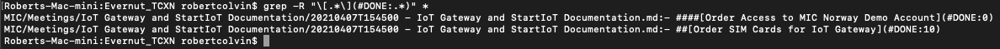

2021-04-12 12:44:39
- checked with Amit, shouldnt be able to run unknonw applications (and indeed i cant)
- the imdone.io atom plugin kinda works, but doens't have all the features and is not being maintained
- so, option? runup a pi and move note taking to that?
  - shared folder? - virtual box on Windows PC?
  - work on Mac?
  - run it on the touch screen - at least the visualizer would be good
  - putting it on linux would mean git control properly (watching for file changes)
  - can i mount a directory from a pi to my windows PC?
  - having it on a pi would mean i get access from multiple PCs and can even work from mobile (at home)
  - lets test it on mac first
- if i want one-board to rule them all, but with separate sync; then put all the folders i want to see on the board in one top level directory and git below that
- still have to swap between files, but im not sure im getting away with that
- would be good if IMDONE would send notifications/alerts (set up push-notification) for reminders based on due-date (i think I read something about this in the documentation)
  ####[Read the imdone documentation and see if i can improve the workflow](#NOTE:30)
  - this would be good for recurring things as well; like on Sunday, i should get a reminder about cleaning the coffee machine and link to the instructions
- These notes are collecting "good ideas" - need to capture them better

2021-04-13T14:07:40

- ####[Atom Snippets for IMDONE like taks, meetings etc](#TODO:7.96875)
  - had some on the windows version of atom for names as well

- ####[Review notes and tasks](#TODO:5.9375)
  - have too many notes sititng in the "TODO"; how to handle? (short task, with links to longer descriptions)
  - use the fact that only 5 columns fit on the screen at a time - hide things off screen!
  - have the "notes column" can I use that for something?

- ####[Atom/IMDONE 'good ideas'](#NOTE:0)
  - how to capture "good ideas" - inspiration perhaps as well

- ####[how to handle Atom/IMDONE 'project backlog'?](#NOTE:10)
- ####[Atom/IMDONE 'references'](#NOTE:20)
  - started using these in work projects like "StartIoT Startup" to catch the resources
  - references can be very generic, so need a good way to store and reuse (but also make them retrievable)

- ####[Find a WYSIWYG MD Editor](#TODO:1.875)
  - i want to be able to write in Markdown and have it convert it show the image, or link or whatever
  - this would let me link between cards _inside_ the editor, rather than at the imdone viewer
    - needs to support images and media
    - needs to support expansions/Snippets
    - needs to support date/time insertion

- imdone forces you into particular columns which is not completely flexible
- a problem with the way imdone works is the tasks can get bigger when you add notes, id like to see just a little bit and then expand (this might be in the documentation though)
  - and since you can't link from a card to another (arbitrary) note (only the file where the note was created) you can't move the notes somewhere else
  - though link card -> original note, then from note to file/anchor where the work is done? -> update link for as work is done

- ####[cross platform note sharing and editing](#NOTE:40)
  - github for non private notes
  - private server for private files (what can i mount on my windows PC?)
  - cross platform kanban viewing would be the natural follow on
    - imdone gives you three licenses _if_ you can see the notes that is!

2021-04-13T14:18:42
- it's becoming apparent that navigating the folder structure i have built in Atom is painful
  - maybe this is an issue now when I am starting up (i really only started using imdone and atom yesterday!) and bringing lots of tasks in, so i wonder what it will be like if/when i am more "steady state", not moving things around and working on a small number of tasks at a time (and then i can have the notes open and easily swap and the folders are more collapsed)
  - I really don't like having to try and categorize things, its a problem... i want to make a task, and focus on the task itself, not where to put the notes

2021-04-13T14:27:09
- creating a file per task - for example "Learn & Document IoT Gateway" is the EPIC, and then there is the task "IoT Gateway Startup" with the notebook: "IoT Gateway Startup.md"
  - this doesn't capture chronology, but as a task might have multiple days in it, adding date to the filename won't help
  - the chronology of the task itself is captured in the file
  - using a flat structure, with each entry a single note-object would mean you capture the entire project chronology as well...
- have also noticed, these files of notes might start to get verrrry long! will be interesting to see how that works in reality
  - the benefit of having everything in one file is when working remotely on other devices, you just open the file and go
- have to admit that so far though, at least the file names are easily understood! (unlike my previous attempt)

2021-04-13T15:06:45
- it's really easy to mess up the imdone format, and then it fails
  - it might just look wrong, but mostly a typo means that it doesn't show up at all
  - you get no warning if something was parsed wrong
  - this will be helped by using snippets of course, so you just fill in the blanks
- you can only open the file (from imdone) which contains the card; you then have to scroll and find what you're looking for
  - would be good to open up to the actual line (though you can edit the card in imdone of courses)

2021-04-13T15:15:10
- ####[Automate storing of Evernut Files in Git (local and remote)](#TODO:50)

2021-04-13T15:24:39
- oops! imdone freaked out and i had a phantom duplicate note; restart seems to have fixed that
- split screen in imdone would be nice; get a few more columns in... (adding one for work "references" - it will be of screen though)
  - thought i could work around it by adding a second board with the same folder, but diferent config.. nope!
    - makes sense since there is imdone metadata stored in the folder
- imdone doesn't parse MD inside notes very well (links for example)
  - i take that back; it works fine, they even seem to be clickable

2021-04-14
Looking into obsidian
  1. https://obsidian.md/features
  2. Templates: (allows to insert tasks etc): https://help.obsidian.md/Plugins/Templates
  3. Text Expansion: (useful for many things! names, etc - but also possible instead of templates for notes, APs for imdone): https://forum.obsidian.md/t/integrated-text-expander/3476/10
  4. Auto insert Date (https://forum.obsidian.md/t/keyboard-shortcuts-to-enter-current-date-time/110/45)
  5. Pasting Screenshots and images (https://forum.obsidian.md/t/better-filenames-for-images-copied-from-clipboard/1240)
  6. Embed files (not just images! Youtube embed as well!) https://help.obsidian.md/How+to/Embed+files
  7. Working with Multiple Notes: https://help.obsidian.md/How+to/Working+with+multiple+notes
  8. Link to Blocks: https://help.obsidian.md/How+to/Link+to+blocks
  9. Internal Blocks: https://help.obsidian.md/How+to/Internal+link
  10. Folding (will be good when a note gets too long): https://help.obsidian.md/How+to/Folding
  11. creating virtual collections? combination of tags?
  12. Obsidian supports symlinks? https://help.obsidian.md/Advanced+topics/How+Obsidian+stores+data ... what use case do they see? does it help me with reusing one note in another place?
    - how would symlink work across platforms though?
  13. Obsidian and Git! https://forum.obsidian.md/t/obsidian-git-plugin-for-automatic-vault-backup-with-git/7790
    1. a howto about using git with obsidian: https://forum.obsidian.md/t/obsidian-github-integration-for-sync-and-version-control/6369
      - written by Bryan Jenkins who i watched on YouTube the other day talking about Obsidian with Zettelkasten and Andy evergreen notes
      - he also talks about using this for work behind firewall; scripts and a bunch of other good stuff
      - basically the same thing on medium: https://medium.com/analytics-vidhya/how-i-put-my-mind-under-version-control-24caea37b8a5
  14. Tag Pane: https://help.obsidian.md/Plugins/Tag+pane
  15. Page Preview: https://help.obsidian.md/Plugins/Page+preview (though if i can click links in the actual note itself this is less of a need for wysiwyg)
  16. Random Note: https://help.obsidian.md/Plugins/Random+note (help stumble on old things)
  17. Outline Plugin: https://help.obsidian.md/Plugins/Outline (can i use this to collect a list of all the tasks and then link since imdone will just take me to the note?)
  18. Obsidian Mobile is coming
    Is there a mobile app?
      Finally, our mobile app is in private beta!
      You can read about the beta here.(https://help.obsidian.md/Obsidian/Mobile+app+beta) - (can get acccess for one time fee of $50)
      For current workarounds, you can also refer to this (https://forum.obsidian.md/t/how-do-i-work-with-obsidian-on-mobile/471) great thread on our forum for a comprehensive list.
  19. WYSIWYG is in the plans according to the FAQ (see above, it might not be that important in reality)
  20. Plugins for Obsidian for my needs?
  21. seems the imdone dev uses obsidian (https://forum.obsidian.md/t/file-as-kanban-board/11801/2) and there's is also a plugin which seems to be actively developed still: https://github.com/imdone/imdone-obsidian-plugin
  22. there is a sync method: https://obsidian.md/sync ($4 per month; how does this work? can i select what is synced?)
    1. according to https://help.obsidian.md/Licenses+%26+add-on+services/Obsidian+Sync#:~:text=To%20start%20syncing%2C%20first%20you,Connect%22%20button%20next%20to%20it. yes! selective syn on folders!
    2. version history is included - every 10 seconds (!)
      - can i diff a note? doesn't seem like it; so git might be the best way rather than sync
      - can i write-protect a note? (read only mode) : forum: https://forum.obsidian.md/t/obsidian-viewer-or-view-only-mode-vault-setting/6833/15
        - seems no; but being plain text on disk, how do you do this realistically? chmod? would work locally i guess - sync would mess it up though
        - version control is a way around this (if you can do a diff)


2021-04-14T23:20:38
- sitting and playing with obsidian for a while... it feels close, but not quite
  - creating links inside a doc, expecting it to create the file and be linkable works, but you need to get the path right
  - as an editor, Atom is much, much nicer in look and feel
    - colors, font size and font; tabs also (all missing in Obsidian)
    - have to zoom out and the screen is not really usable
  - image paste is good with the preview; but i actually like the way image paste works in atom a bit better
    - though being able to link to any file is a plus
    - though i think if i host my notes on a git server then i just link to the arbitrary file?
  - tags are a good feature, didn't get them to work, but wondering if thats my expectation or even if im not really sure what i want from them!
    - but you tag a note and then you can see them
  - got date insertion working, and auto creating a zettelkasten note was good (uses datetime for the filename)
  - imdone seems to mess with the backlinking? not sure - this is a good feature though
  - i got caught in a hybrid work flow; i want to believe my ultimate need is to have all notes in a flat hierarchy but the reality of setting that up is not so easy
    - what do you call the file? simple, but really... what do you call it?
    - how do you find the note that you are working on?
    - in iTunes, you have the song title, artist to look for - then you have the other metadata that you can use for sorting etc
      - i need the same thing; i need a title - but i struggle to find what that is, or hate the overhead of creating the title
      - realistically it's the name of the task isnt it?
      - the more the process of creating a new note can be automated; even creating/adding the metadata (like tags being autosuggested)
        - when I create a new task in imdone it could create the new file for me for the notes and then link it properly to the task both in the source notes and imdone
- overall i think the atom workflow is allowing me to get more done - maybe after working with obsidian for a while that might change; but so far atom + imdone is the best combination.
- atom + wysiwyg? might be nice... (obsidian has the same problem having to preview to see the results; though the MD parser seemed better at obsidian)
- need to wait for obsidian to mature? but again... maybe I just want a diferent work flow? -> am i back to my own tool again? :)
  - obsidian held so much promise
- one thing I have discovered again tonight is ensuring my notes are accurate and not accidentally changed - this is why version control is such a key part for me
- am i spending more time creating and maintaining notes? is this getting in the way of actually getting stuff done?
  - is this a real problem, or just because i have a backlog of admin to do? (postits all over the place; old notes in multiple storage locations), because im setting up a new tool, a new flow.. and a new job with new tasks?
  - once i have everything setup, i might hit a steady state?
  - right now, im having lots of meetings, which is generating lots of tasks - but having said that, i did a lot of work today and just documented it; i had meetings which resulted in new tasks, and they neeed to be managed... so maybe its unavoidable
  - also, i worked across two computers today, so i need to manage that data created
  - switching between tools is also creating a backlog of admin... im in a bit of a "need to get work done, but the admin is not being done"
- given these notes are all Markdown, then i could migrate to obsidian later (even with a big load of notes)
  - obsidian has a markdown importer; what does that do?
- considering a post to imdone / obsidian
- ... it's funny, there is all these tools, and if i could pick a little bit of this, and little of that ... and combine them it'd be pretty damn good!
  - ... what to do...?! (go to bed!)
- ... tomorrow i've got notes from today to import and handle; most of the kids will be at school though, so thats ok! :)

2021-04-15T08:08:01
- i want to remove the overhead of notetaking and being organised
- i don't want to have to take a bunch of notes, then mess around
  - which folder does this note belong in?
  - will i need this note again?
  - how do i handle this thought so it comes up again?
  - how do i save this resource/reference for later?
  - do i want to keep all this work in one place or in chronological order?
  - oh, that note's been edited - what changes were made?
  - im away from the PC, now i have 10.000 post-its to work with
  - im on a diferent PC, now i have a scratch note to deal with
  - etc...
- i want to just work, take notes and let the system work out what im doing and take care of it
- phsycial things have the problem, they can only be in one place at a time; so then you have adam savage "I i need this in 3 years time, where is the first place i would look?"
  - thats not bad for notetaking to get it somewhere ... but i think notes have some basic characteristics no matter what
    - they have a time of creation
    - they have an author
    - they probably have an intuitive title - you are writing a note about *something* what is that *something*
      - is it a task?
      - is it a meeting (which will have a subject)
      - etc
    the *something* is then the note title
      - if you already have that title, then you can update the existing one (or create a new note)
      - if you don't provide a title, the system
        - gives a default pattern to save the file
        - it might give suggestions (based on content and previous notes -> machine learning of your habits)
          - it could be based on key words; for example if i start a note with
          "ordered the AD2 from digilent last night"
          i would know that this was an online shopping note
            - the formatting would be auto generated
            - it could guess at the title "Analog Discovery 2"
            - state could be inferred as "Ordered"
            - "last night" implies a fuzzy date, but can be converted to a rough time (that is expected to be updated)
            - it could infer keywords, AD2 and digilent (i might choose to accept or edit those suggestions)
            - based on my existing notes it would see that AD2 is part of contextual electronics, building a workbench, electronics and would suggest those tags
            - since its in state "ordered" - there would be some trackers attached to it
              - have you budgeted it?
              - when has it moved to shipped? delivered?
              - tracking info etc
            - now with one small sentence I have been able to automatically build a note, and I didn't really have to think about anything - i got my thought on the page and the system handled the rest
            - the sytem can map the keywords in the shopping note template to a viewer (MVC) and show it in a table (it can combine all orders and show one big table... whatever is required!)
      - categorization can be handled explicitly by tags, keywords and other metadata like creation date, update date
      - categorization can also be handled implicitly, automatically by the sytem by inferring context and machine learning
    - they might have a broad subject area (work, home, etc) which defines separation
  - when you have a meeting, you take MoM - based on existing work, the sytem can pick up existing tasks, and link the notes to them - it can also find unexpected tasks etc and prompt you to create those.
    - when a new task is created in the system, the associated notes are automatically created
- the tools I have now are close, so close - but they still want to do things the old way...
2021-04-15T15:55:32
- some more examples on the above
  - "collection notice for KiwiBox with ID ABC123US came - need to collect from hemköp before 2021-04-28"
  - "collected KiwiBox with ID AB123US from Hemköp at 21:30 today"
  - "credit card bill arrived with due date 2021-04-15T15:56:58 and amount 5249.99"
  - "received bill for inkomstförsakring with due date ..."
    - "paid credit card bill for value 12312 today"

2021-04-15T08:48:13
- case in point; started talking to Steven on Slack re: telenor pakistan - i have no notes on this (in this format - they are in the old way, and need to be imported). so i start to create a task; realised that Telenor Pakistan might have more work later, moved and created a new EPIC (here, EPICs are really collections, but imdone usese EPICs only, so thats what i use to collect common subtask) - thought for two seconds and the note became "Trackin Solution Cos Improvements" - thats what the note is about, and thats the task basically... simple! thats what my system needs to do

2021-04-15T10:27:45
- bringing the USB drive from Windows to Mac (with all my notes etc) - scanning on BitDefender


2021-04-15T15:22:19
- when moving meeting notes there is the problem of linking notes to tasks
  - task created (maybe during a meeting)
    - this is where the task is, and the status updates etc (this can be edited via the imdone UI)
  - from this task I create a notebook (a file in a folder)
  - I need a meeting, so i book a meeting, and send an agenda
    - (I make a note in the task note that a meeting was booked, and link to it)
    - at this point I create a file in a folder under meetings (this because meetings can be about many subjects, and also can be recurring so having them chronologically in one place makes sense)
      - i attach the agenda to the meeting note
      - i do some work in prep - and i include that in the meeting note, since i want that information availble during the meeting (its prep work)
      - (link to the original task note, that the agenda is set and sent)
  - now we have the meeting, and i take MoM which goes into the Meeting note in the meetings folder
  - there is now a disconnect, so I have to
    - make a note in the task note, that i had a meeting and link to it!
  (there is some duplication and overhead here which is easy to mess up)
  - APs have the same problem - i created an AP in the 1:1 with MkK to create an agenda, when i review the notes, ill have no idea where that AP came from (and since it will be in state "DONE" in imdone, i wont be able to easily track-it from there)
    - linking this together is kinda useful
    - when the task/AP etc is created, the notes are automatically created, and then linked throughout (Obsidian kidna does this)
    - i also mention this above

- I think I need to setup some dev env with vue or something, bring in tiny.mce and start working on something (use Atom for the time being)
  - having the web interface makes linking to things much, much easier
- ####[Problem to Solve: Linking between APs, Tasks, Notes and MoM](#NOTE:10)
  - there is information all over the place when you create tasks in one place and action them somewhere else
  - need to sit down and think about how it can work/could work/should work
  - linking task creation -> notes -> meeting -> etc

  - quick one-liners to find notes
    `all task types
    grep -R "\[.*\](#.*:.*)" * | awk -F']' '{print $2}' | awk -F':' '{print $1}' | awk -F# '{print $2}' | sort -u

    AP
    BLOCKED
    DOING
    DONE
    EPICS
    RESOURCES
    TODO

    all tasks in state "DONE"
    grep -R "\[.*\](#DONE:.*)" *```
    
    (had to use a screenshot as copying the terminal output was causing a conflict with imdone; i'd comment out the paste, then when id save the file, imdone would put it back)

2021-04-15T21:56:44
- i should only work from tasks in imdone; otherwise i will likely get out of sync
- ####[experiment with aws comprehend - NLP for handling, parsing, categorizing notes from plain text](#TODO:20)

- ####[mockup a gui for note taking](#TODO:40)
  - atom look and feel
  - obsidian functionality
  - widgets
  - imdone functionality (based on collections)

- ####[mac git autocommit changed files](#TODO:30)
  - 2021-04-16T12:38:52 : cheating by a quick script to go through the projects and commit
  - some links to read:
    - https://stackoverflow.com/questions/1515730/is-there-a-command-like-watch-or-inotifywait-on-the-mac
    - https://stackoverflow.com/questions/420143/making-git-auto-commit

2021-04-16T12:44:30
- looking around at other markdown editors, in the appstore i found [Agenda](https://agenda.com/), which is described as "Date-focused note taking"
  - i tried this a City, and it was in the right direction, but again fell flat
  - why?
    - UI is too big
    - although integrating dates and everything is nice, it doesn't cover all my needs
  - so, again - a tool that has some nice features that I would steal, but is missing many other features!
