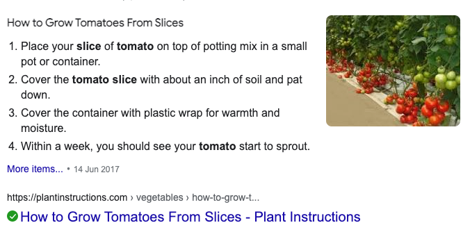

2021-04-16T13:51:27
- i built the Arduino NB-1500 based monitor last weekend (still not up and running, but this is also StartIoT and IoT GW learning)
- after pussels adventure, i have replanted a tomato for ebbe and watered all the plants
  - the basil, smultron, and parsely are the only ones that haven't sprouted!
  - gave them a cover of plastic wrap
  - tomato planting from
  
